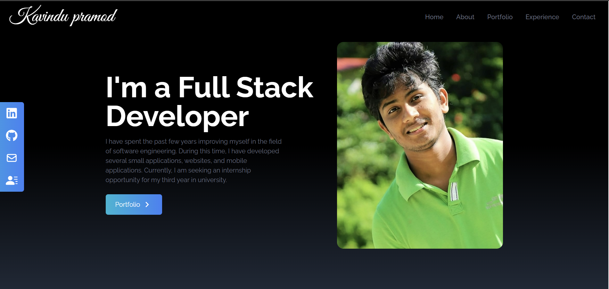

# My Portfolio

This is my portfolio website showcasing my projects and experience. You can visit the live site at [https://www.example.com](https://www.example.com).

## About

This section provides an overview of myself and my background.

I am a student at Informatics Institute of Technology (IIT) Sri Lanka, pursuing a BSc in Software Engineering. I am passionate about web development and have worked on several projects that you can find in the Portfolio section.

## Portfolio

In the Portfolio section, you can explore some of the projects I have worked on. Each project card includes links to the live demos and the corresponding GitHub repositories.

## Experience

The Experience section highlights my previous work experiences, internships, or any relevant professional engagements. You can find more details about my skills and contributions in this section.

## Contact

If you have any inquiries or would like to get in touch with me, feel free to use the contact form provided on the Contact page. Submit the form to send me a message, and I will get back to you as soon as possible.

## Technologies Used

- HTML
- CSS
- JavaScript
- React.js

## How to Run the Project Locally

1. Clone this repository to your local machine.
2. Navigate to the project directory.
3. Run `npm install` to install the required dependencies.
4. Run `npm start` to start the development server.
5. Open your browser and visit `http://localhost:3000` to view the website locally.

Feel free to explore my portfolio and check out the projects I've worked on. If you have any suggestions or feedback, I'd be happy to hear from you!

---

Built with ❤️ by Kavindu Pramod.
